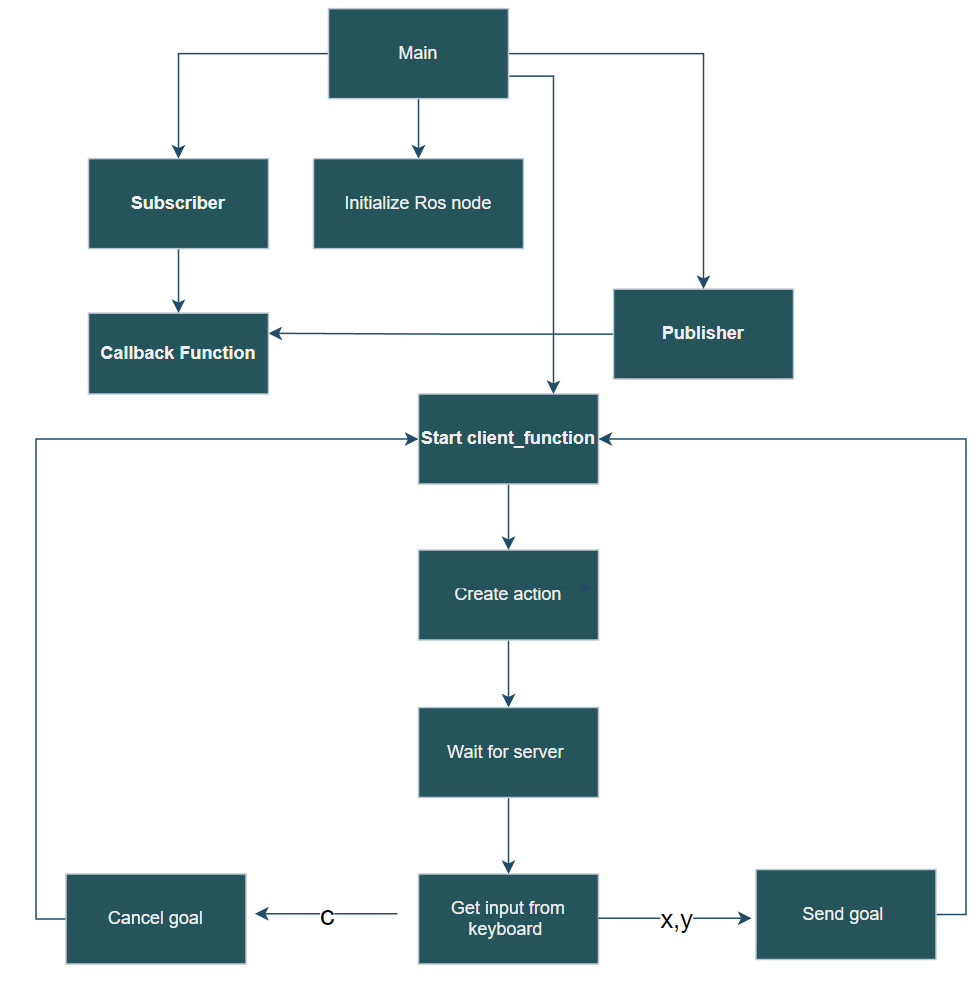

# Research Track 1 - Assignment 2
### Emanuele Buzzurro  - S5147474
## Introduction
In this assignment, I developed three nodes and a launch file using ROS (Robot Operating System) library. The nodes are:

1. An action client node which allows the user to set a target (x, y) or cancel it. It also publishes the robot's position and velocity as a custom message (x, y, vel_x, vel_y) by subscribing to the '/odom' topic.
2. A service node that prints the number of goals reached and cancelled when called.
3. A node that subscribes to the robot's position and velocity from the custom message and prints the distance of the robot from the target and the robot's average speed. The frequency of publishing this information can be set through a parameter in the launch file.

Additionally, the package includes three other nodes: bug_as.py, go_to_point_service.py, and wall_follow_service.py, which provide additional functionality.

A launch file, assignment1.launch, is included to start the simulation. The frequency of publishing information by the third node can be set in this file.

## Nodes
The package includes the following nodes:

1. Publisher-Client_nodeA.py - The action client node that allows the user to set a target or cancel it, and also publishes the robot's position and velocity as a custom message on the topic '/pos_and_vel'.
2. Service_nodeB.py - The service node that prints the number of goals reached and cancelled when called.
3. Subscriber_nodeC.py - The node that subscribes to the robot's position and velocity from the topic '/pos_and_vel' and prints the distance of the robot from the target and the robot's average speed with a frequency set by a parameter in the launch file.

## ROS Start
After starting the program through the command:

    - roslaunch assignment2 assignment2.launch
four windows will be available:

- Rviz - A ROS visualization tool.
- Gazebo - A 3D simulator environment with obstacles and the robot.
- Publisher-Client_nodeA.py - A window where the user can set the goal position or cancel it from the keyboard.
- Subscriber_nodeC.py - A window where the distance from the target and average speed of the robot are displayed.

To view the number of goals reached and cancelled, you can type the following command in a separate terminal:
    
        - rosservice call /goals_n

The frequency of publishing information by the third node can be set in the launch file assignment1.launch within the launch folder.

## Flowchart 
The flowchart below shows the flow of the node_A of the program: 

